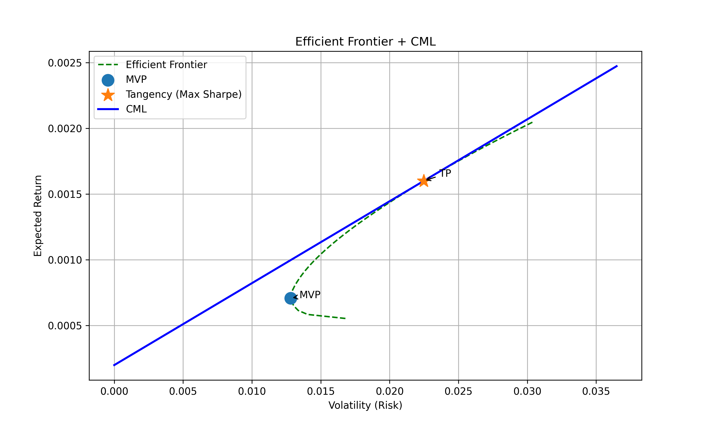

# Portfolio Optimization using Modern Portfolio Theory

This project demonstrates how to use historical stock data to build an optimized investment portfolio based on the principles of Modern Portfolio Theory (MPT) and Markowitz optimization.

## Tools & Libraries
- Python
- yfinance
- numpy, pandas
- matplotlib, seaborn
- scipy.optimize

## Objective
To construct a portfolio with the best risk-adjusted return (Sharpe Ratio) and visualize the efficient frontier.

## Structure
- `data/`: raw price data
- `src/`: all reusable code
- `notebooks/`: exploration and optimization steps
- `results/`: final portfolio and backtest results
- `plots/`: generated charts

## Sample Output

## Contact
Project by Jakub Gołąb 
[\[LinkedIn\]](https://www.linkedin.com/in/jakub-golab/) | [\[GitHub\]](https://github.com/Agonyy24)
